# Use Case Diagram - Sistem Manajemen Kehadiran dan Surat

## Identifikasi Aktor

Berdasarkan struktur ERD yang diberikan, berikut adalah aktor-aktor yang teridentifikasi:

### 1. **Karyawan/Peserta Magang**
- Pengguna yang melakukan absensi kehadiran
- Menerima penugasan pekerjaan
- Dinilai kinerjanya

### 2. **Admin/HR**
- Mengelola data pengguna
- Mengelola master data (jurusan, divisi, status surat)
- Memproses surat balasan
- Mengelola penilaian kinerja

### 3. **Supervisor/Manager**
- Memberikan penugasan pekerjaan
- Melakukan penilaian kinerja karyawan
- Memonitor kehadiran

### 4. **Pemohon Eksternal**
- Mengajukan surat permohonan
- Menerima surat balasan

## Use Case Diagram

```mermaid
graph TB
    %% Actors
    Karyawan[👤 Karyawan/Peserta Magang]
    Admin[👤 Admin/HR]
    Supervisor[👤 Supervisor/Manager]
    Pemohon[👤 Pemohon Eksternal]
    
    %% System boundary
    subgraph "Sistem Manajemen Kehadiran dan Surat"
        %% Kehadiran Management
        UC1[Catat Kehadiran Masuk]
        UC2[Catat Kehadiran Keluar]
        UC3[Upload Foto Kehadiran]
        UC4[Lihat Riwayat Kehadiran]
        UC5[Monitor Kehadiran Karyawan]
        
        %% User Management
        UC6[Kelola Data Pengguna]
        UC7[Registrasi Pengguna Baru]
        UC8[Update Profil Pengguna]
        
        %% Job Description Management
        UC9[Buat Penugasan Kerja]
        UC10[Lihat Penugasan Kerja]
        UC11[Update Status Pekerjaan]
        UC12[Upload Gambar Pekerjaan]
        
        %% Performance Assessment
        UC13[Buat Penilaian Kinerja]
        UC14[Lihat Hasil Penilaian]
        UC15[Update Penilaian]
        
        %% Letter Management
        UC16[Proses Surat Permohonan]
        UC17[Buat Surat Balasan]
        UC18[Kelola Status Surat]
        UC19[Lihat Riwayat Surat]
        
        %% Master Data Management
        UC20[Kelola Master Jurusan]
        UC21[Kelola Master Divisi]
        UC22[Kelola Master Status Surat]
    end
    
    %% Relationships
    %% Karyawan relationships
    Karyawan --> UC1
    Karyawan --> UC2
    Karyawan --> UC3
    Karyawan --> UC4
    Karyawan --> UC10
    Karyawan --> UC11
    Karyawan --> UC12
    Karyawan --> UC14
    Karyawan --> UC8
    
    %% Admin relationships
    Admin --> UC6
    Admin --> UC7
    Admin --> UC5
    Admin --> UC16
    Admin --> UC17
    Admin --> UC18
    Admin --> UC19
    Admin --> UC20
    Admin --> UC21
    Admin --> UC22
    
    %% Supervisor relationships
    Supervisor --> UC9
    Supervisor --> UC5
    Supervisor --> UC13
    Supervisor --> UC15
    Supervisor --> UC19
    
    %% Pemohon relationships
    Pemohon --> UC16
    Pemohon --> UC19
```

## Deskripsi Use Cases

### **Modul Kehadiran**
1. **UC1 - Catat Kehadiran Masuk**: Karyawan mencatat waktu masuk dengan email dan foto
2. **UC2 - Catat Kehadiran Keluar**: Karyawan mencatat waktu keluar
3. **UC3 - Upload Foto Kehadiran**: Karyawan mengupload foto sebagai bukti kehadiran
4. **UC4 - Lihat Riwayat Kehadiran**: Karyawan melihat riwayat kehadirannya
5. **UC5 - Monitor Kehadiran Karyawan**: Admin/Supervisor memonitor kehadiran semua karyawan

### **Modul Manajemen Pengguna**
6. **UC6 - Kelola Data Pengguna**: Admin mengelola data lengkap pengguna
7. **UC7 - Registrasi Pengguna Baru**: Admin mendaftarkan pengguna baru
8. **UC8 - Update Profil Pengguna**: Karyawan mengupdate profil pribadi

### **Modul Penugasan Kerja**
9. **UC9 - Buat Penugasan Kerja**: Supervisor memberikan penugasan kepada karyawan
10. **UC10 - Lihat Penugasan Kerja**: Karyawan melihat penugasan yang diberikan
11. **UC11 - Update Status Pekerjaan**: Karyawan mengupdate progress pekerjaan
12. **UC12 - Upload Gambar Pekerjaan**: Karyawan mengupload bukti hasil kerja

### **Modul Penilaian Kinerja**
13. **UC13 - Buat Penilaian Kinerja**: Supervisor menilai kinerja karyawan
14. **UC14 - Lihat Hasil Penilaian**: Karyawan melihat hasil penilaiannya
15. **UC15 - Update Penilaian**: Supervisor mengupdate penilaian yang sudah ada

### **Modul Manajemen Surat**
16. **UC16 - Proses Surat Permohonan**: Admin memproses surat permohonan dari eksternal
17. **UC17 - Buat Surat Balasan**: Admin membuat surat balasan untuk pemohon
18. **UC18 - Kelola Status Surat**: Admin mengelola status surat
19. **UC19 - Lihat Riwayat Surat**: Admin/Supervisor/Pemohon melihat riwayat surat

### **Modul Master Data**
20. **UC20 - Kelola Master Jurusan**: Admin mengelola data master jurusan
21. **UC21 - Kelola Master Divisi**: Admin mengelola data master divisi
22. **UC22 - Kelola Master Status Surat**: Admin mengelola data master status surat

## Hubungan Antar Use Case

### Include Relationships
- UC1, UC2 include UC3 (Upload Foto Kehadiran)
- UC17 include UC16 (Proses Surat Permohonan)
- UC13 include UC6 (Kelola Data Pengguna)

### Extend Relationships
- UC4 extends UC1, UC2 (Riwayat kehadiran diperluas dari pencatatan)
- UC19 extends UC17 (Riwayat surat diperluas dari pembuatan surat)

### Generalization
- UC5 adalah generalisasi dari UC4 (Monitor adalah versi admin dari lihat riwayat)

## Prioritas Use Case

### **High Priority**
- UC1, UC2, UC3: Pencatatan kehadiran (core functionality)
- UC6, UC7: Manajemen pengguna dasar
- UC16, UC17: Proses surat (bisnis utama)

### **Medium Priority**
- UC9, UC10, UC11: Manajemen penugasan
- UC13, UC14: Penilaian kinerja
- UC20, UC21, UC22: Master data

### **Low Priority**
- UC4, UC5: Monitoring dan reporting
- UC15: Update penilaian
- UC19: Riwayat surat