# Use Case Diagram - Sistem Manajemen Kehadiran dan Surat

## Deskripsi Sistem
Sistem ini mengelola kehadiran karyawan, data pengguna, deskripsi pekerjaan, penilaian kinerja, dan surat-surat balasan dengan master data untuk jurusan, divisi, dan status surat.

## Use Case Diagram

```mermaid
graph TB
    %% Actors
    Admin[👤 Admin]
    HR[👤 HR Manager]
    Manager[👤 Manager/Atasan]
    Employee[👤 Employee/Karyawan]
    Applicant[👤 Applicant/Pemohon]
    
    %% Use Cases - Kehadiran
    UC1[📝 Record Attendance<br/>Mencatat Kehadiran]
    UC2[📸 Upload Photo<br/>Upload Foto Kehadiran]
    UC3[📊 View Attendance Report<br/>Lihat Laporan Kehadiran]
    UC4[⏰ Check In/Out<br/>Check In/Out]
    
    %% Use Cases - Users
    UC5[👤 Manage Users<br/>Kelola Data Pengguna]
    UC6[📝 Create User Profile<br/>Buat Profil Pengguna]
    UC7[✏️ Update User Info<br/>Update Informasi Pengguna]
    UC8[👀 View User Details<br/>Lihat Detail Pengguna]
    
    %% Use Cases - Jobdesc
    UC9[💼 Manage Job Descriptions<br/>Kelola Deskripsi Pekerjaan]
    UC10[📋 Assign Tasks<br/>Berikan Penugasan]
    UC11[📷 Upload Job Images<br/>Upload Gambar Pekerjaan]
    UC12[📊 Track Job Status<br/>Lacak Status Pekerjaan]
    
    %% Use Cases - Penilaian
    UC13[📊 Conduct Performance Assessment<br/>Lakukan Penilaian Kinerja]
    UC14[📈 Evaluate Discipline<br/>Evaluasi Kedisiplinan]
    UC15[🎯 Assess Responsibility<br/>Nilai Tanggung Jawab]
    UC16[💬 Evaluate Communication<br/>Evaluasi Komunikasi]
    UC17[📋 Generate Performance Report<br/>Buat Laporan Kinerja]
    
    %% Use Cases - Surat Balasan
    UC18[📄 Manage Response Letters<br/>Kelola Surat Balasan]
    UC19[📝 Create Response Letter<br/>Buat Surat Balasan]
    UC20[📋 Process Applicant Request<br/>Proses Permintaan Pemohon]
    UC21[📤 Send Response Letter<br/>Kirim Surat Balasan]
    UC22[📊 Track Letter Status<br/>Lacak Status Surat]
    
    %% Use Cases - Master Data
    UC23[🏢 Manage Departments<br/>Kelola Jurusan]
    UC24[🏭 Manage Divisions<br/>Kelola Divisi]
    UC25[📋 Manage Letter Status<br/>Kelola Status Surat]
    UC26[📊 View Master Data<br/>Lihat Data Master]
    
    %% Actor Connections - Admin
    Admin --> UC1
    Admin --> UC3
    Admin --> UC5
    Admin --> UC6
    Admin --> UC7
    Admin --> UC8
    Admin --> UC9
    Admin --> UC10
    Admin --> UC11
    Admin --> UC12
    Admin --> UC13
    Admin --> UC17
    Admin --> UC18
    Admin --> UC19
    Admin --> UC20
    Admin --> UC21
    Admin --> UC22
    Admin --> UC23
    Admin --> UC24
    Admin --> UC25
    Admin --> UC26
    
    %% Actor Connections - HR Manager
    HR --> UC1
    HR --> UC3
    HR --> UC5
    HR --> UC6
    HR --> UC7
    HR --> UC8
    HR --> UC13
    HR --> UC14
    HR --> UC15
    HR --> UC16
    HR --> UC17
    HR --> UC18
    HR --> UC19
    HR --> UC20
    HR --> UC21
    HR --> UC22
    HR --> UC26
    
    %% Actor Connections - Manager
    Manager --> UC1
    Manager --> UC3
    Manager --> UC8
    Manager --> UC9
    Manager --> UC10
    Manager --> UC11
    Manager --> UC12
    Manager --> UC13
    Manager --> UC14
    Manager --> UC15
    Manager --> UC16
    Manager --> UC17
    Manager --> UC18
    Manager --> UC19
    Manager --> UC20
    Manager --> UC21
    Manager --> UC22
    Manager --> UC26
    
    %% Actor Connections - Employee
    Employee --> UC4
    Employee --> UC8
    Employee --> UC12
    Employee --> UC17
    Employee --> UC22
    
    %% Actor Connections - Applicant
    Applicant --> UC20
    Applicant --> UC21
    Applicant --> UC22
    
    %% Include Relationships
    UC1 -.->|include| UC2
    UC13 -.->|include| UC14
    UC13 -.->|include| UC15
    UC13 -.->|include| UC16
    UC19 -.->|include| UC20
    UC19 -.->|include| UC21
    
    %% Extend Relationships
    UC3 -.->|extend| UC17
    UC22 -.->|extend| UC26
    
    %% Styling
    classDef actor fill:#e1f5fe,stroke:#01579b,stroke-width:2px
    classDef useCase fill:#f3e5f5,stroke:#4a148c,stroke-width:2px
    classDef includeRel fill:#fff3e0,stroke:#e65100,stroke-width:1px,stroke-dasharray: 5 5
    classDef extendRel fill:#e8f5e8,stroke:#2e7d32,stroke-width:1px,stroke-dasharray: 5 5
    
    class Admin,HR,Manager,Employee,Applicant actor
    class UC1,UC2,UC3,UC4,UC5,UC6,UC7,UC8,UC9,UC10,UC11,UC12,UC13,UC14,UC15,UC16,UC17,UC18,UC19,UC20,UC21,UC22,UC23,UC24,UC25,UC26 useCase
```

## Penjelasan Use Case

### Actors (Aktor):
1. **Admin** - Administrator sistem dengan akses penuh
2. **HR Manager** - Manajer HR yang mengelola SDM dan penilaian
3. **Manager/Atasan** - Atasan yang mengelola tim dan pekerjaan
4. **Employee/Karyawan** - Karyawan yang menggunakan sistem
5. **Applicant/Pemohon** - Pemohon yang mengajukan surat

### Use Cases Utama:

#### Kehadiran (Attendance):
- **Record Attendance** - Mencatat kehadiran karyawan
- **Upload Photo** - Upload foto kehadiran
- **View Attendance Report** - Melihat laporan kehadiran
- **Check In/Out** - Proses check in/out karyawan

#### Users:
- **Manage Users** - Mengelola data pengguna
- **Create User Profile** - Membuat profil pengguna baru
- **Update User Info** - Mengupdate informasi pengguna
- **View User Details** - Melihat detail pengguna

#### Jobdesc:
- **Manage Job Descriptions** - Mengelola deskripsi pekerjaan
- **Assign Tasks** - Memberikan penugasan
- **Upload Job Images** - Upload gambar terkait pekerjaan
- **Track Job Status** - Melacak status pekerjaan

#### Penilaian (Assessment):
- **Conduct Performance Assessment** - Melakukan penilaian kinerja
- **Evaluate Discipline** - Evaluasi kedisiplinan
- **Assess Responsibility** - Menilai tanggung jawab
- **Evaluate Communication** - Evaluasi komunikasi
- **Generate Performance Report** - Membuat laporan kinerja

#### Surat Balasan:
- **Manage Response Letters** - Mengelola surat balasan
- **Create Response Letter** - Membuat surat balasan
- **Process Applicant Request** - Memproses permintaan pemohon
- **Send Response Letter** - Mengirim surat balasan
- **Track Letter Status** - Melacak status surat

#### Master Data:
- **Manage Departments** - Mengelola data jurusan
- **Manage Divisions** - Mengelola data divisi
- **Manage Letter Status** - Mengelola status surat
- **View Master Data** - Melihat data master

### Relationships:
- **Include** (dotted line with arrow): Use case yang harus dijalankan
- **Extend** (dotted line with arrow): Use case opsional yang dapat dijalankan